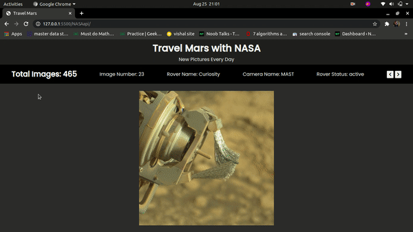

# mars-viewer
Mars viewer is a web project where it works with the NASA api to fetch details like images, rover status, which camera was used and etc for the Mars pictures. It displays different images each day by using the date, new date means new images. :D

## How to access?
Please go to [mars-viewer](https://dipanshparmar.github.io/mars-viewer) to access the web app.

## Demo

## Contributing
Pull requests are welcome. For major changes, please open an issue first to discuss what you would like to change.

Please make sure to update tests as appropriate.

## License
[MIT](https://choosealicense.com/licenses/mit/)